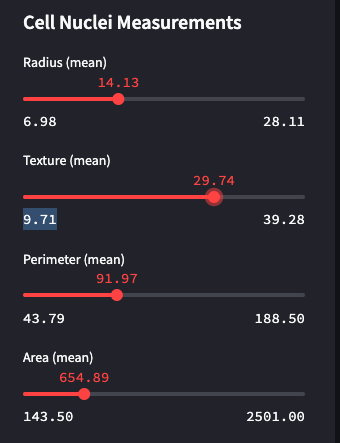
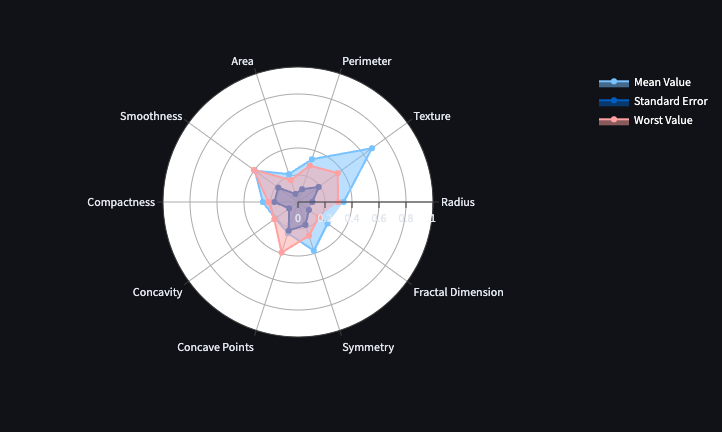
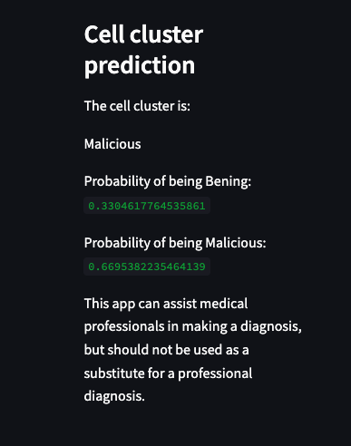

# Breast cancer diagnosis predictor

## Overview

The Breast Cancer Diagnosis app uses machine learning to help medical professionals diagnose breast cancer. The app determines breast cancer risk from measures. 

****
A radar graphic shows the expected diagnosis and likelihood of being **benign** or **malignant**.
****
****

 The app can be used to manually enter measurements or link to a cytology lab to get machine-generated data. 

The application was created utilising the publicly available Breast Cancer Wisconsin (Diagnostic) Data Set <https://www.kaggle.com/datasets/uciml/breast-cancer-wisconsin-data> as a machine learning exercise. It should be noted that the reliability of this dataset may be compromised, given that it was created solely for educational purposes in the domain of machine learning and not for professional utilisation.

A live version of the application can be found on Streamlit Community Cloud <https://breastcancerpredict-6mygrkqy6lk6fjhteurjfg.streamlit.app/>.

## Instalation

To run the Cell Image Analyzer locally, you will need to have Python 3.6 or higher installed. Then, you can install the required packages by running:

pip install -r requirements.txt

## Run

To start the app, simply run the following command:

streamlit run app.py

